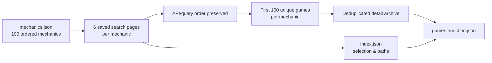
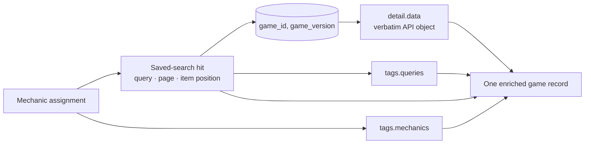
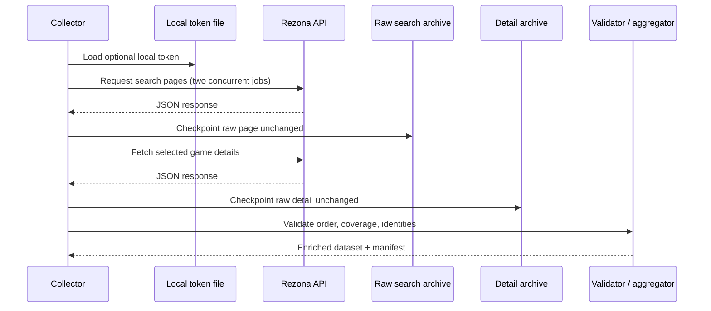
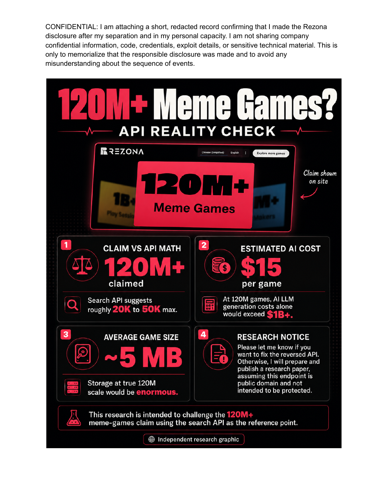

# Rezona API Archive

<p align="center">
  
</p>

<p align="center">
  An open evidence trail for what observed Rezona API responses return.<br>
  <a href="https://hassanvfx.github.io/rezona-api/">Project overview</a> ·
  <a href="#dataset">Dataset</a> ·
  <a href="#method">Method</a> ·
  <a href="#search-coverage-and-cost-scenarios">Coverage analysis</a> ·
  <a href="#api-reconstruction-reference">API reference</a> ·
  <a href="#disclosure-and-responsible-use">Disclosure</a>
</p>

## Rezona says it has 120M+ games. Are they real?

An author-provided historical disclosure attributes that claim to Rezona. This
repository does not independently verify it. Instead, it offers a reproducible method
for testing the observable evidence returned by the API.

Here is the first question the claim raises: if 120M represented completed games,
would that imply **$120M at $1/game** or **$1.2B at $10/game**? Yes—under those
conditional scenarios. It does **not** establish Rezona's actual spend, provider,
workflow, inventory, or the legal status of source data.

This repository turns observed Rezona API responses into a repeatable collection and
aggregation workflow. Its expanded corpus contains **10,528 unique game/version
records**: 10,000 mechanics-led memberships plus 2,000 deterministic keyword-space
pilot memberships.

It is an archive of returned metadata—not a claim that technical accessibility alone
creates permission to reuse content. Source availability, rights, and endpoint
behavior can change. Use this project responsibly and respect applicable terms,
privacy, and intellectual-property rights.

## The evidence ladder

|  |  |  |
| --- | --- | --- |
|  |  |  |
| **The claim:** 120M+ Rezona games? Historical disclosure-attributed context, not independently verified here. | **The question:** Would that imply $120M at $1/game? Only if the count and scenario input were true. | **What we saw:** 40,026 observed IDs in saved API query windows: a reproducible lower bound. |


**The limit: 156,988 is exploratory—not a total.** This overlap model output cannot
establish an inventory, actual data lake, census, or confidence interval because the
searches are title-derived, dependent, and capped.

## The story in 60 seconds

| Step | What we did | What we can honestly say |
| --- | --- | --- |
| 1. Claim and scenario | Preserve the historical 120M+ statement as attributed context and make the $1/$10 multiplication explicit. | It is a conditional comparison—not a verified cost or count. |
| 2. Token-cost benchmark | Show current GPT-5.6 Terra and Sol token-rate examples, including output/reasoning usage across multiple build/revision requests. | $1 and $10 are technically plausible scenario brackets; Rezona's provider, workflow, and costs remain unknown. |
| 3. Observed archive | Combined the 100-mechanic archive with a fixed-seed, 60-query keyword-space pilot, retaining query/API order and raw provenance. | **40,026** distinct IDs were observed; the pilot added **7,788** beyond the original raw-search union. This is a lower bound. |
| 4. Exploratory overlap model | Use one-term (`f1 = 31,947`) and two-term (`f2 = 4,363`) appearance counts in a transparent Chao2-style calculation. | **156,988** is an exploratory adaptive-search model output—not Rezona’s verified inventory, actual data lake, platform census, or a confidence interval. |


## Dataset

[`data/rezona/games.enriched.json`](data/rezona/games.enriched.json) is the public,
deduplicated corpus. It now includes the mechanics collection and keyword-space pilot.

```text
1f57b4116658341ffd0c6be194e202877e8cc0ec2709adc92f8f5bfa439c5a6a
```

Its [manifest](docs/data/manifest.json) records the file size and checksum. Each
record has the following form:

```json
{
  "game": { "...": "verbatim detail.data object" },
  "tags": {
    "mechanic_ids": ["parkour"],
    "mechanics": [{"id": "parkour", "name": "Parkour"}],
    "queries": ["parkour"],
    "collection_ids": ["mechanics-full"],
    "discovery_methods": ["mechanics_catalog"]
  },
  "provenance": [{
    "collection_id": "mechanics-full",
    "discovery_method": "mechanics_catalog",
    "mechanic_id": "parkour",
    "query": "parkour",
    "page": 1,
    "item_position": 1,
    "selected_rank": 1,
    "search_path": "data/rezona/search/parkour/parkour/page-1.json"
  }]
}
```

Records are uniquely identified by `(game_id, game_version)`, sorted by first
observed selection. `game` preserves the API detail object, while tags and provenance
explain why and where the record entered this corpus. Raw search and detail payloads
are retained locally as reproducibility sources but intentionally excluded from Git.

## Method

The ordered catalog in [`mechanics.json`](mechanics.json) defines 100 recognizable
game mechanics. For each mechanic, the collector saves two 100-item pages for each
of three ordered search queries, preserves API order, then selects the first 100
unique game IDs within that mechanic. A detail response is fetched once per unique
game/version, even when a game belongs to several mechanics.





The collector uses two concurrent requests, bounded exponential retries, and a
checkpoint after every saved response. The aggregator verifies all selected
memberships, source hits, detail identities, and output totals. The complete factual
record is kept in the [collection journal](docs/journals/rezona-viral-mechanics-corpus.md).

## API reconstruction reference

[`api-reconstruction.md`](api-reconstruction.md) is the working reverse-engineering
record for the observed Rezona API surface. It distinguishes **confirmed live
behavior**, **strong inferences from application artifacts**, and **open questions**.
It is not a claim that every platform route has been reproduced or that behavior will
remain stable.

The documented base API is `https://api.rezona.ai/api/v3`. The following endpoint
families have confirmed request and response behavior:

| Area | Confirmed routes | Notes |
| --- | --- | --- |
| Topics | `topic/all`, `topic/detail?topic_id=…`, `game/get_by_topic?topic_id=…` | Topic discovery and topic-scoped game lists. |
| Explore | `game/explore-theme/list`, `game/explore-theme/games?name=…` | Theme discovery and theme-filtered games. |
| Search | `search?type=game&q=…&page=…&size=…` | Page-based search; confirmed types include user, game, audio, bgm, sfx, image, meme, and video. |
| Game metadata | `game/detail?game_id=…&game_version=…`, `game/creation-templates` | Detail is the archive's canonical per-game input; templates expose creation presets. |
| Assets | `asset/page?type=…&page=…&size=…` | Page-based asset inventory; documented types include image, audio, bgm, sfx, video, and meme. |
| Comments | `comment/detail`, `comment/replies`, `comment/mention-candidates` | Parameter requirements are recorded; some real-ID probes remain open. |
| Notifications | `notification/list`, `notification/unread/count`, `notification/read/all` | Cursor pagination; account-coupled and not used by the corpus collector. |
| Creation / account | `user/login_as_tourist`, `game/publish`, legacy/V3 generation routes | Documented for research completeness; these are stateful or auth-coupled and are out of scope for collection. |

The corpus itself relies only on game search and game detail responses. The
reconstruction document also records pagination behavior, parameter validation,
response shapes, auth sensitivity, and unresolved endpoints. Treat state-changing
routes as out of scope unless you have explicit authorization for your own account.

## Search coverage and cost scenarios

The combined saved windows contain **40,026 distinct observed game IDs** across 350
literal query terms and 720 pages. This is a reproducible lower bound, not an
estimate of Rezona's platform inventory or full searchable lake: **318 of 350 terms**
reached the API's 200-result ceiling, leaving unseen tails unknown.

| Scenario | Games | At $1 per completed indexed game | At $10 per completed indexed game |
| --- | ---: | ---: | ---: |
| Original curated corpus | 8,528 | $8,528 | $85,280 |
| Expanded enriched corpus | 10,528 | $10,528 | $105,280 |
| Combined observed lower bound | 40,026 | $40,026 | $400,260 |
| Exploratory adaptive-search overlap estimate | 156,988 | $156,988 | $1,569,880 |
| Historical 120M comparison (unverified) | 120,000,000 | $120,000,000 | $1,200,000,000 |

The $1/$10 figures are scenario inputs, not audited pricing or cost claims. They
apply only to completed indexed games and exclude failed attempts, retries, hosting,
moderation, storage, and other platform costs. The sensitivity uses
`40,026 + 31,947² / (2 × 4,363) = 156,988`; title-derived, capped, and dependent query
windows violate its inference assumptions, so it is exploratory only. It is not an
inventory estimate or confidence interval. Read the full
[claim, token-cost, and overlap methodology](docs/research/search-coverage-cost-scenarios.md)
and its machine-readable [analysis snapshot](docs/data/search-coverage-analysis.json).

## Keyword-space discovery pilot

A separate adaptive discovery pilot sampled 60 long-tail title terms (30 unigrams and
30 bigrams) from the existing enriched corpus with a fixed seed. Its 120 saved search
pages returned 11,341 items and exposed **9,102 game IDs not present in the original
enriched corpus**. It then archived valid details for the first 2,000 newly observed
IDs in deterministic query/page/API order.

It added **7,788 IDs beyond the original raw-search union** and its 2,000 detailed
selections are now merged into the public corpus. This expands discovery diversity,
but it is not a probability sample of Rezona games. Raw captures remain local and
Git-ignored; see the public [pilot catalog](docs/data/keyword-space-pilot.json) and
[aggregate summary](docs/data/keyword-space-pilot-summary.json).

### Reproduce locally

```bash
python3 tools/collect_rezona_corpus.py --full
python3 tools/collect_rezona_corpus.py --validate
python3 tools/aggregate_rezona_games.py
python3 tools/analyze_rezona_search_coverage.py
python3 -m unittest discover -s tests -v
```

### Obtain or renew a local token

The collector can use an optional token for **your own authorized Rezona account**.
It falls back to anonymous requests where the endpoint permits them. The token file is
local-only, ignored by Git, and must never be committed.

1. Sign in at [`create.rezona.ai/login`](https://create.rezona.ai/login) and continue
   to your workspace.
2. Open your browser's developer tools, choose **Network**, and filter for a successful
   request to `api.rezona.ai/api/v3` made by your signed-in session.
3. In that request's headers, copy only the bearer token value from the
   `Authorization` request header. Do not copy cookies, browser exports, or unrelated
   session values.
4. Create or update the ignored local file:

   ```bash
   printf '%s\n' 'REZONA_ACCESS_TOKEN=replace-with-your-own-token' > .rezona.local.env
   chmod 600 .rezona.local.env
   ```

5. Run the collector. It reports only whether a token is configured; it never prints
   the token value.

   ```bash
   python3 tools/collect_rezona_corpus.py --full
   ```

If the token expires or an authenticated request fails, sign in again and replace the
local value. Do not paste credentials into issues, commits, screenshots, journals,
or generated JSON. Revoke or replace a token if it is accidentally disclosed.



Editable diagram sources are in [`docs/diagrams`](docs/diagrams).

## Disclosure and responsible use

The repository includes an author-provided historical record of a disclosure made to
Rezona: [Rezona API accessibility disclosure (PDF)](docs/disclosure/rezona-api-accessibility-disclosure.pdf).
It is preserved to document the reported sequence of events. It is not independent
verification of every statement, estimate, or opinion contained in the record, and
the repository does not adopt its historical assertions as legal conclusions.

The selected research-notice page is reproduced below as a context artifact; it does
not contain chat-account names or incidental personal identifiers.



### What the disclosure questioned

The disclosure's research graphic questioned a historical **“120M+” meme-games**
marketing claim and paired it with a hypothetical **“$15 per game”** generation-cost
estimate. Its author contrasted that claim with an observed search-result range and
argued that, if both the 120M figure and the $15 assumption were true, the implied
generation spend would be very large.

This repository preserves that question, but does **not** present it as a verified
finding. The distinction matters:

| Question | What this project can say |
| --- | --- |
| Does the collection prove Rezona has 120M games? | No. The corpus is a mechanics-led sample, not a complete platform census. |
| Does API search prove the platform has only the number of results visible for a query? | No. Search is query-dependent, paginated, and capped; it is not a global-count endpoint. |
| Does the corpus disprove a historical marketing claim? | No. It preserves reproducible observations and makes no conclusion about a platform-wide total. |
| Does the project verify a $15 per-game generation cost or total spend? | No. That is a historical author assumption in the disclosure, not an audited pricing figure. |

The fair, reproducible claim is narrower: at the time of collection, observed search
responses supported an expanded corpus of 10,528 deduplicated game/version records across a
deliberately selected set of 100 mechanics. They do not by themselves establish a
global inventory, current pricing, total compute spend, or the truth or falsity of
any historical marketing number.

Future work could test a specific public claim only with a documented methodology:
the claim's date and wording, endpoint coverage, pagination rules, deduplication
identity, query bias, inaccessible/private inventory, and a stated uncertainty range.
Until then, the disclosure remains a historical research notice and the dataset
remains a transparent sample with provenance.

This project does not include credentials, cookies, authorization headers, exploit
instructions, or private browser-session data. For correction, removal, or rights
concerns, follow the [source-data notice and correction process](docs/data/NOTICE.md).

## License

Original repository code, documentation, diagrams, and generated header art are
licensed under [MIT](LICENSE). The license does not grant rights in Rezona-sourced
game data, creator-provided material, trademarks, or other third-party content.
