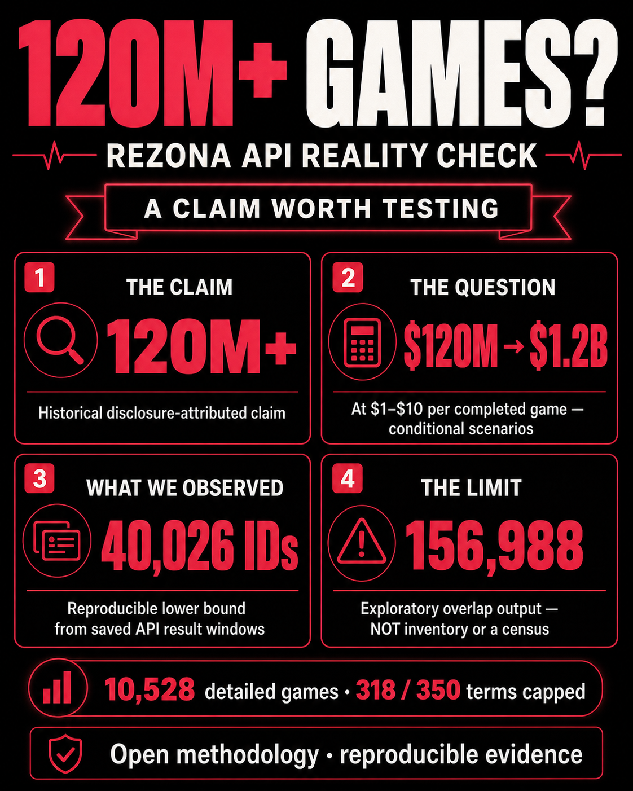

# Rezona Says It Has 120M+ Games. Did It Cost $120M to Generate Them?

> A claim worth testing: what publicly retrievable API evidence can show, what a
> simple $1–$10-per-game scenario would imply, and where the method stops.



Rezona has been associated with a **“120M+ games”** claim in an
[author-provided historical disclosure](../disclosure/rezona-api-accessibility-disclosure.pdf).
It is a striking number. It invites an obvious question: if those were completed,
generated games, did making them cost $120 million?

At **$1 per completed game**, 120 million games means **$120 million**. At **$10 per
completed game**, it means **$1.2 billion**. The multiplication is simple. The
conclusion is not.

Those are conditional scenarios—not a claim that Rezona spent that money, used any
particular model, or even that the historical count has been independently verified.
They are a way to make the scale question concrete. The question is no longer only
“is 120M a big number?” It becomes: **what evidence would make that number
checkable?**

## Start with the claim. Then separate the questions.

This investigation does not claim that public API accessibility makes the source data
legally public, nor does it claim that a search endpoint can reveal a company’s full
internal history. It starts from a narrower proposition: public-facing API responses
can be archived, inspected, and reproduced as evidence of what was observable at a
specific time.

That produces four separate questions:

1. Was the 120M+ statement made? The disclosure preserves it as historical,
   author-provided context.
2. What would the count imply under transparent generation-cost assumptions?
3. How many distinct public game IDs can we actually observe through saved search
   windows?
4. Can search overlap turn that observed evidence into a defensible platform total?

Only the third question has a direct measurement in this project. The rest need
careful labels.

## Why ask about $1 or $10 per game?

One finished game can involve more than one model request: planning, implementation,
debugging, rewriting, and revision. A transparent token-budget model is:

```text
input tokens × input rate + output/reasoning tokens × output rate
```

As dated public reference points, OpenAI’s GPT-5.6 Terra and Sol documentation list
input/output rates that make both $1 and $10 aggregate, multi-request budgets
technically plausible for a complex generation workflow. For example, a high-output
reasoning workflow can reach those brackets through cumulative planning and revision,
not necessarily one request.

That does **not** tell us what Rezona used. Its model provider, prompts, caching,
retries, media-generation workflow, discounts, and non-token costs are unknown. The
$1 and $10 figures exclude failed attempts, hosting, storage, moderation, licensing,
and support. They are scenario inputs—not audited pricing and not evidence of spend.

Still, scenario arithmetic is useful. It tells readers what must be true before a
large creation claim can be discussed in economic terms.

## So we built an evidence trail instead of a guess

The [Rezona API Archive](https://github.com/hassanvfx/rezona-api) records saved game
search results and game-detail responses. It preserves query choices, result order,
page number, item position, selected rank, and the detail object that followed.

The collection began with 100 recognizable mechanics and their ordered query sets.
It later added a deterministic 60-query keyword-space pilot. The public enriched
corpus now contains **10,528 detailed game/version records**. That is not a claimed
platform count; it is the selected, provenance-preserving corpus readers can inspect.

Across the saved search windows, the two collections produced **40,026 observed
unique game IDs**. The second collection added **7,788 IDs** beyond the original
raw-search union. That is the project’s strongest scale statement:

> **40,026 is a reproducible observed-ID lower bound. It is not a census.**

The distinction matters because search is not an inventory endpoint. Query terms shape
what appears; ranking is opaque; and many result windows are capped. In the combined
frame, **318 of 350 literal terms** reached the 200-result ceiling. There are unknown
tails behind those windows.

## The seductive number we refuse to call a total

The archive also calculates a Chao2-style overlap sensitivity from how often IDs
appear across merged literal query terms. In the combined frame:

```text
40,026 + 31,947² / (2 × 4,363) = 156,988
```

That produces **156,988**. It is interesting because it demonstrates how much
additional searchable-result diversity an overlap model can suggest when most IDs are
seen only once.

It is also exactly the sort of number that can be misused.

The term set is title-derived and adaptive, not randomly sampled from a representative
vocabulary. Related queries are dependent. Ranking behavior is opaque. Most query
terms are capped. For those reasons, **156,988 is an exploratory adaptive-search
overlap output—not Rezona’s inventory, actual data lake, platform census, or a
confidence interval.**

The project publishes a stress test precisely to make that sensitivity visible:

| Query frame | Observed IDs | Chao2-style output |
| --- | ---: | ---: |
| Original mechanics frame | 32,238 | 124,859 |
| Combined frame | 40,026 | 156,988 |
| Uncapped-only subset | 2,555 | 31,741 |

If the output changes substantially with the frame, it should not be marketed as a
single answer to “how many games exist?”

## What this investigation does—and does not—say

It says a historical 120M+ claim is worth testing, not repeating uncritically. It
says $120M and $1.2B are transparent conditional arithmetic if a 120M completed-game
count and the stated per-game scenarios were true. It says the archived query windows
show at least 40,026 distinct public IDs were observed.

It does **not** say that Rezona spent $120M or $1.2B. It does not prove 120M games
exist, disprove the historical claim, establish an internal creation total, or turn
an exploratory overlap calculation into a census. And it does not grant reuse rights
in third-party content.

That restraint is the point. A claim of this size should be met with a method that is
open enough for other people to rerun, criticize, and improve.

## Read, inspect, reproduce

- [Repository and public enriched dataset](https://github.com/hassanvfx/rezona-api)
- [GitHub Pages evidence overview](https://hassanvfx.github.io/rezona-api/)
- [Search coverage and cost-scenario methodology](search-coverage-cost-scenarios.md)
- [Machine-readable coverage snapshot](../data/search-coverage-analysis.json)
- [Collection journal](../journals/rezona-viral-mechanics-corpus.md)
- [Historical disclosure record](../disclosure/rezona-api-accessibility-disclosure.pdf)

The useful outcome is not a viral number. It is a public trail from a claim, through
an observable method, to the limits of what that method can honestly establish.
